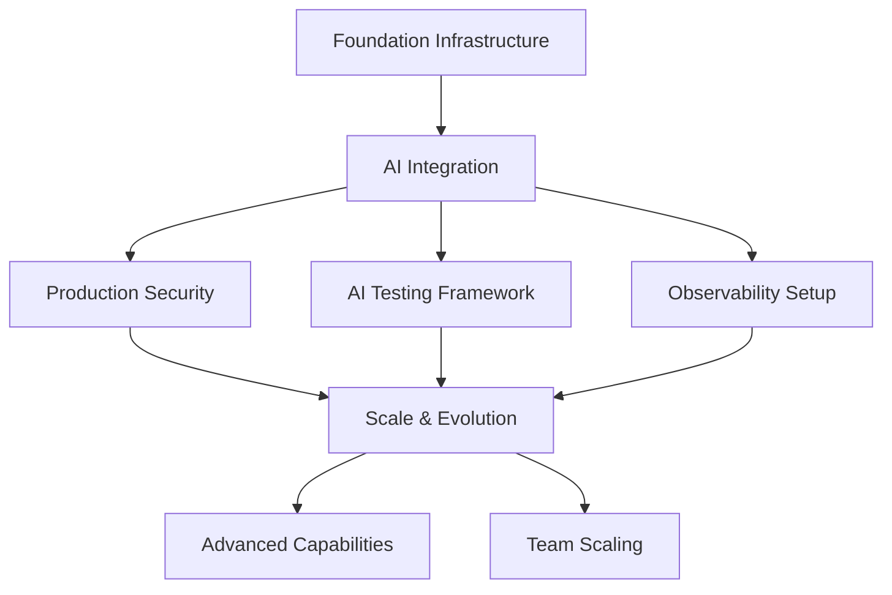

# AI-Native Development Framework 2025: Complete Methodology & Architecture

**Document Type**: Comprehensive Development Framework
**Created**: January 17, 2025
**Updated**: January 19, 2025
**Status**: Enhanced with Vercel Design System Integration
**Scope**: Complete AI-native development methodology with 8-layer pipeline + design system

## 🎯 Executive Summary

This framework synthesizes our comprehensive research into a complete AI-native development methodology. It integrates the **8-layer technology pipeline** (Node.js 24.8.0 → Vercel AI Cloud + Design System), production readiness analysis (security, observability, testing, edge AI), MCP tool generation capabilities, and the emerging AI-Native Full-Stack Engineer archetype into a practical development approach that transforms how software is conceived, built, and deployed with **automatic accessibility and performance optimization**.

**Core Insight**: We're transitioning from "writing code" to "orchestrating intelligence" - where AI generates capabilities and humans design experiences.

---

## 🧠 AI-Native Development Paradigm

### **Fundamental Shift: From Code to Capability**

**Traditional Development:**
```
Requirements → Design → Code → Test → Deploy → Maintain
(Linear process, human-written code)
```

**AI-Native Development:**
```
Intent → Generate → Orchestrate → Validate → Evolve
(Iterative process, AI-generated capabilities)
```

### **The AI-Native Engineer Mindset**

**Core Competencies:**
1. **Prompt Architecture**: Design AI behavior through systematic prompt engineering
2. **System Orchestration**: Coordinate AI agents and tools rather than write explicit logic
3. **Capability Generation**: Transform existing systems into AI tools through MCP
4. **Edge Intelligence**: Deploy AI processing at every layer for optimal performance
5. **Continuous Validation**: AI-assisted testing and quality assurance

**Mental Model Transformation:**
- **From Functions to Agents**: Business logic becomes AI agent behavior
- **From APIs to Tools**: Integrations become AI-accessible capabilities
- **From Deployment to Distribution**: Applications become intelligent edge networks
- **From Monitoring to Intelligence**: Observability becomes predictive optimization

---

## 🏗️ Complete Architecture Framework

### **8-Layer AI-Native Pipeline with Design System**

**Layer 0: Foundation Runtime**
- **Node.js 24.8.0**: Native TypeScript execution (67-400% performance)
- **AI Integration**: Built-in AI model loading and inference capabilities
- **Edge Deployment**: WebAssembly compilation for global distribution

**Layer 1: Development Framework**
- **Next.js 15.5**: Turbopack production builds (2-5x faster compilation)
- **AI-First Routing**: Intelligent caching and edge optimization
- **Tool Generation**: MCP-to-AI-SDK automatic capability creation

**Layer 2: UI Runtime**
- **React 19.1**: Server Components + React Compiler optimization
- **AI-Enhanced UX**: Predictive interfaces and adaptive user experiences
- **Real-time Collaboration**: WebRTC integration for human-AI interaction

**Layer 3: Type System**
- **TypeScript 5.9.2**: Go-based compiler (10x performance improvement)
- **AI Tool Types**: Auto-generated types from MCP server capabilities
- **End-to-end Safety**: Full-stack type safety from UI to database

**Layer 4: Styling Architecture**
- **Tailwind CSS v4**: Oxide engine (100x faster incremental builds)
- **AI-Assisted Design**: Automatic responsive and accessible styling
- **Component Optimization**: Intelligent CSS generation and purging

**Layer 5: Component Distribution**
- **shadcn/ui Platform**: Universal component registry (182x faster resolution)
- **AI Component Generation**: Automatic component creation from requirements
- **Intelligent Composition**: AI-optimized component combinations

**Layer 6: Deployment Platform**
- **Vercel AI Cloud**: Global edge deployment (85% cost reduction)
- **AI-Native Infrastructure**: Built-in AI model deployment and scaling
- **Intelligent Optimization**: Automatic performance and cost optimization

**Layer 7: AI-Enhanced Design System**
- **Vercel Design Guidelines**: Accessibility-first, performance-optimized UX patterns
- **AI-Generated Interfaces**: Automatically accessible and performant components
- **Inclusive Intelligence**: Adaptive UX for diverse user needs and contexts
- **Motion Awareness**: Automatic respect for user motion preferences

**AI Amplifier Layer:**
- **Vercel AI SDK 5.0**: 100+ models, tool calling, generative UI
- **MCP Integration**: Universal system connectivity through tool generation
- **Agent Orchestration**: Multi-agent workflows and decision making

**Backend Infrastructure:**
- **Supabase**: AI-first backend with PostgreSQL + pgvector
- **Real-time Capabilities**: Live data synchronization and collaboration
- **AI Security**: Row-level security with AI-aware access controls

### **MCP Tool Generation Revolution**

**Traditional Integration:**
```typescript
// Manual API integration
const result = await fetch('/api/github/issues');
const data = await result.json();
// Process data manually...
```

**AI-Native Integration:**
```typescript
// Auto-generated AI tools from MCP servers
import { githubTools } from '@generated/mcp-tools';

const result = await generateWithTools({
  model: 'gpt-4',
  tools: githubTools,
  messages: [{ role: 'user', content: 'Create an issue for the bug fix' }]
});
// AI handles the entire workflow
```

**Capability Generation Workflow:**
1. **MCP Server Discovery**: Identify existing system capabilities
2. **Tool Generation**: `mcp-to-ai-sdk generate --server=target-system`
3. **Type Integration**: Auto-generated TypeScript definitions
4. **AI Orchestration**: Include tools in AI agent workflows
5. **Continuous Evolution**: Tools update automatically with system changes

---

## 🎨 AI-Native Design Framework

### **Vercel Design System Integration**

**Core Design Principles:**
```typescript
type AIDesignPrinciples = {
  accessibility_first: "AI generates WCAG 2.1 AA compliant interfaces automatically",
  performance_native: "Design decisions optimize Core Web Vitals by default", 
  inclusive_intelligence: "AI adapts interfaces for diverse user needs and contexts",
  semantic_automation: "AI chooses appropriate HTML elements before adding ARIA",
  motion_awareness: "AI respects user preferences and cognitive load automatically",
  forgiving_interactions: "AI designs predictable, recoverable user experiences"
};
```

### **AI-Enhanced UX Generation**

**Traditional UX Development:**
```jsx
// Manual accessibility and performance implementation
<button 
  className="px-4 py-2 bg-blue-500 text-white"
  aria-label="Submit form"
  tabIndex={0}
>
  Submit
</button>
```

**AI-Native UX Generation:**
```typescript
// AI generates accessible, performant components automatically
const smartButton = await generateComponent({
  intent: "form submission button",
  context: "checkout flow",
  guidelines: vercelDesignGuidelines,
  accessibility: {
    level: "WCAG_2_1_AA",
    userTesting: true,
    adaptiveUX: true
  },
  performance: {
    coreWebVitals: "optimized",
    motionPreferences: "respected",
    touchTargets: "44px_minimum"
  }
});

// Generated component includes:
// - Semantic HTML structure
// - Automatic ARIA labels
// - Focus management
// - Touch-friendly sizing
// - Motion preference respect
// - Performance optimization
```

### **Accessibility Automation**

**Complete Accessibility Pipeline:**
```typescript
const accessibilityFramework = createAccessibilityFramework({
  automated_compliance: {
    wcag_2_1_aa: "100% automatic compliance validation",
    semantic_html: "AI chooses correct elements automatically",
    aria_labels: "Contextually appropriate labels generated",
    keyboard_navigation: "Logical tab order implemented",
    color_contrast: "WCAG AA contrast ratios enforced",
    motion_safety: "prefers-reduced-motion respected"
  },
  
  ai_enhancements: {
    adaptive_interfaces: "Adjust for user capabilities",
    predictive_assistance: "Anticipate user needs",
    context_awareness: "Understand user goals and constraints",
    inclusive_design: "Support diverse interaction patterns"
  },
  
  testing_integration: {
    axe_core: "Automated accessibility testing",
    lighthouse: "Performance and accessibility scoring",
    real_user_testing: "AI simulates diverse user interactions",
    continuous_monitoring: "Accessibility regression prevention"
  }
});
```

### **Performance-First Design Generation**

**AI-Optimized Performance Patterns:**
```typescript
const performantDesign = createPerformantDesign({
  core_web_vitals: {
    lcp: "optimize_critical_content_loading",
    fid: "minimize_interaction_blocking",
    cls: "explicit_dimensions_prevent_shifts"
  },
  
  vercel_optimizations: {
    image_optimization: "automatic WebP/AVIF conversion",
    font_optimization: "next/font with display swap",
    bundle_splitting: "intelligent code splitting",
    edge_caching: "optimal caching strategies"
  },
  
  ai_performance: {
    predictive_preloading: "AI predicts user journeys",
    adaptive_loading: "Load content based on context",
    intelligent_bundling: "Optimize for actual usage patterns",
    real_time_optimization: "Continuous performance tuning"
  }
});
```

---

## 🔄 AI-Native Development Methodology

### **Phase 1: Intent Definition**
**Traditional**: Write detailed requirements documents
**AI-Native**: Define AI behavior specifications

```typescript
// Behavior specification example
const userAuthAgent = defineAgent({
  purpose: "Handle user authentication and authorization",
  capabilities: [
    "Process login attempts with security validation",
    "Generate secure sessions with appropriate permissions",
    "Handle password resets with email verification",
    "Manage user profile updates with data validation"
  ],
  tools: await generateTools(['supabase-auth', 'email-service', 'audit-log']),
  constraints: {
    security: "Follow OWASP guidelines and zero-trust principles",
    privacy: "GDPR compliant data handling",
    performance: "Sub-200ms response times"
  }
});
```

### **Phase 2: Capability Generation**
**Traditional**: Design APIs and data models
**AI-Native**: Generate AI tools from existing systems

```bash
# Generate tools from all integrated systems
mcp-to-ai-sdk generate \
  --servers=supabase,stripe,github,email \
  --output=./src/tools/ \
  --types=typescript

# Generated tools become available immediately
```

### **Phase 3: Agent Orchestration**
**Traditional**: Implement business logic
**AI-Native**: Design agent interactions and workflows

```typescript
// Multi-agent workflow example
const ecommerceWorkflow = createWorkflow({
  agents: {
    productCatalog: await loadAgent('product-management'),
    userProfile: await loadAgent('user-personalization'),
    orderProcessing: await loadAgent('order-fulfillment'),
    customerService: await loadAgent('support-assistance')
  },

  flow: async (userIntent: string) => {
    const context = await userProfile.analyzeIntent(userIntent);
    const products = await productCatalog.findRelevant(context);

    if (context.intent === 'purchase') {
      return await orderProcessing.handlePurchase({ user: context, products });
    }

    if (context.intent === 'support') {
      return await customerService.assistUser({ user: context, products });
    }

    return await productCatalog.presentOptions({ user: context, products });
  }
});
```

### **Phase 4: Intelligent Validation**
**Traditional**: Write tests manually
**AI-Native**: AI-generated comprehensive test suites

```typescript
// AI-generated testing
const testSuite = await generateTests({
  target: ecommerceWorkflow,
  scenarios: [
    'happy path user journeys',
    'edge cases and error handling',
    'security vulnerability testing',
    'performance under load',
    'accessibility compliance'
  ],
  frameworks: ['vitest', 'playwright', 'axe-core'],
  coverage: 'comprehensive'
});

// Self-healing tests that adapt to changes
const adaptiveTests = createSelfHealingTests(testSuite);
```

### **Phase 5: Edge Distribution**
**Traditional**: Deploy to servers
**AI-Native**: Distribute intelligence globally

```typescript
// Edge AI deployment
const edgeDeployment = createEdgeFunction({
  wasm: await compileToWasm(ecommerceWorkflow),
  regions: 'all', // Global distribution
  fallback: cloudInference,
  caching: intelligentCaching,
  monitoring: aiObservability
});

// Automatic optimization for each region
await deployWithOptimization(edgeDeployment);
```

### **Phase 6: Continuous Evolution**
**Traditional**: Manual maintenance and updates
**AI-Native**: Self-improving systems with AI monitoring

```typescript
// Continuous improvement system
const evolutionEngine = createEvolutionEngine({
  monitoring: {
    userBehavior: trackInteractionPatterns,
    performance: measureResponseTimes,
    quality: assessOutputQuality,
    business: trackConversionMetrics
  },

  optimization: {
    prompts: optimizeAgentBehavior,
    tools: enhanceCapabilities,
    performance: tuneInferenceSpeed,
    costs: minimizeTokenUsage
  },

  evolution: {
    frequency: 'continuous',
    validation: automaticTesting,
    rollback: safetyMechanisms,
    learning: incorporateFeedback
  }
});
```

---

## 🛡️ Production Readiness Framework

### **Security-First AI Development**

**Core Security Principles:**
1. **Never Trust the Model**: Architecture assumes AI will behave unexpectedly
2. **Defense in Depth**: Multiple security layers for AI interactions
3. **Principle of Least Privilege**: Minimal AI tool permissions
4. **Continuous Validation**: Real-time security monitoring

**Implementation Pattern:**
```typescript
// Security-aware AI tool wrapper
const secureToolWrapper = createSecureWrapper({
  authentication: 'required',
  authorization: checkPermissions,
  inputValidation: sanitizeInputs,
  outputValidation: validateResponses,
  audit: logAllInteractions,
  rateLimit: intelligentThrottling
});

// All AI tools automatically wrapped with security
const secureTools = await generateSecureTools({
  servers: ['supabase', 'stripe'],
  wrapper: secureToolWrapper,
  policies: securityPolicies
});
```

### **AI-Native Observability**

**Monitoring Strategy:**
```typescript
// Comprehensive AI observability
const observability = createAIObservability({
  metrics: {
    inference: ['latency', 'throughput', 'quality'],
    tokens: ['usage', 'cost', 'optimization'],
    agents: ['behavior', 'success_rate', 'tool_usage'],
    users: ['satisfaction', 'task_completion', 'engagement']
  },

  alerts: {
    performance: 'response_time > 2s',
    quality: 'hallucination_rate > 0.1%',
    cost: 'token_cost > budget_threshold',
    security: 'injection_attempt_detected'
  },

  intelligence: {
    anomalyDetection: mlPoweredAnalysis,
    predictiveAlerts: forecastIssues,
    autoOptimization: continuousImprovement,
    rootCauseAnalysis: aiDrivenDiagnostics
  }
});
```

### **AI-Enhanced Testing**

**Testing Philosophy:**
- **AI Generates Tests**: Comprehensive scenario creation
- **AI Maintains Tests**: Self-healing test suites
- **AI Optimizes Tests**: Intelligent execution ordering
- **AI Validates Quality**: Automated quality assessment

**Implementation:**
```typescript
// Complete AI testing framework
const testingFramework = createAITestingFramework({
  generation: {
    unit: generateUnitTests,
    integration: generateAPITests,
    e2e: generateUserJourneys,
    performance: generateLoadTests,
    security: generatePenetrationTests,
    accessibility: generateA11yTests
  },

  execution: {
    parallel: intelligentParallelization,
    adaptive: environmentOptimization,
    healing: selfRepairingTests,
    reporting: aiGeneratedInsights
  },

  validation: {
    llm: validateAIBehavior,
    quality: assessOutputQuality,
    safety: checkAISafety,
    bias: detectUnfairness
  }
});
```

---

## 💼 AI-Native Team Structure

### **New Role Definitions**

**AI Product Engineer**
- **Primary Focus**: AI behavior design and user experience
- **Key Skills**: Prompt engineering, user research, product strategy
- **Responsibilities**: Define AI agent personalities, optimize user interactions

**AI Infrastructure Engineer**
- **Primary Focus**: AI system architecture and deployment
- **Key Skills**: Edge computing, WebAssembly, MCP server development
- **Responsibilities**: Build AI-native infrastructure, optimize performance

**AI Integration Specialist**
- **Primary Focus**: Connect AI to existing business systems
- **Key Skills**: MCP development, enterprise integration, security
- **Responsibilities**: Generate tools from legacy systems, ensure compliance

**AI Quality Engineer**
- **Primary Focus**: AI behavior validation and safety
- **Key Skills**: AI testing frameworks, bias detection, safety evaluation
- **Responsibilities**: Ensure AI reliability, prevent harmful outputs

### **Team Productivity Multipliers**

**3-Person AI-Native Team Capabilities:**
```typescript
const teamProductivity = {
  traditional_team_equivalent: 20, // people
  development_speed: '10-50x faster',
  feature_delivery: 'weeks instead of months',
  system_integration: 'automatic through MCP',
  quality_assurance: 'AI-generated comprehensive testing',
  deployment: 'global edge distribution',
  monitoring: 'intelligent observability',
  maintenance: 'self-healing systems'
};
```

---

## 🚀 Implementation Roadmap

### **Foundation Phase (Dependencies: None)**
**Core Infrastructure Setup**
- [ ] Initialize Next.js 15.5 + React 19.1 + TypeScript project
- [ ] Configure Tailwind CSS v4 with shadcn/ui platform
- [ ] Set up Supabase backend with authentication and database
- [ ] Deploy basic Vercel AI Cloud infrastructure

### **AI Integration Phase (Dependencies: Foundation)**
**AI Capability Development**
- [ ] Implement Vercel AI SDK 5.0 with basic model integration
- [ ] Generate initial tools from existing systems using MCP
- [ ] Create first AI agents for core business logic
- [ ] Establish AI observability and monitoring

### **Production Readiness Phase (Dependencies: AI Integration)**
**Security, Testing, and Optimization**
- [ ] Implement comprehensive AI security framework
- [ ] Deploy AI-enhanced testing with Playwright + Vitest
- [ ] Configure intelligent observability with LLM monitoring
- [ ] Set up edge AI deployment with WebAssembly

### **Scale and Evolution Phase (Dependencies: Production Ready)**
**Advanced Capabilities and Team Scaling**
- [ ] Implement real-time collaboration with WebRTC + AI
- [ ] Deploy multi-agent workflows for complex business processes
- [ ] Create self-improving systems with continuous evolution
- [ ] Scale team with AI-native role specialization

### **Logical Dependencies**



---

## 📊 Success Metrics

### **Technical Performance**
- **Development Velocity**: Features/month vs traditional development
- **Response Performance**: AI inference latency and throughput
- **Cost Optimization**: Operational costs vs traditional architecture
- **Quality Metrics**: Bug rates, security incidents, user satisfaction

### **Business Impact**
- **Time to Market**: Concept to production deployment timeline
- **Team Productivity**: Output per engineer vs traditional teams
- **User Experience**: Engagement, retention, and satisfaction scores
- **Competitive Advantage**: Feature differentiation and market position

### **AI-Specific Metrics**
- **Agent Effectiveness**: Task completion rates and accuracy
- **Tool Utilization**: MCP-generated tool usage and success rates
- **Quality Assurance**: AI safety, bias detection, and output validation
- **Evolution Rate**: System improvement and adaptation speed

---

## 🎯 Strategic Advantages

### **Compound Competitive Benefits**

**Development Speed:**
- **10-50x faster development cycles** through AI automation
- **Weeks instead of months** for complex feature delivery
- **Instant system integration** through MCP tool generation
- **Continuous improvement** through AI-driven optimization

**Technical Superiority:**
- **Sub-second global response times** with edge AI deployment
- **99.9%+ availability** with intelligent edge distribution
- **Automatic scaling** based on demand and performance
- **Self-healing systems** that adapt and improve over time

**Cost Efficiency:**
- **85% reduction in deployment costs** with Vercel AI Cloud
- **60-80% reduction in development resources** needed
- **Automatic optimization** of compute and storage costs
- **Reduced maintenance overhead** with self-managing systems

**Innovation Capacity:**
- **Rapid experimentation** with AI-generated prototypes
- **Real-time user feedback integration** for continuous improvement
- **Advanced capabilities** (real-time collaboration, edge AI, multi-modal)
- **Future-proof architecture** that evolves with AI advancement

---

## 📚 Learning Resources & Next Steps

### **Essential Skills Development**
1. **Prompt Engineering**: [OpenAI Guide](https://platform.openai.com/docs/guides/prompt-engineering)
2. **Vercel AI SDK**: [Official Documentation](https://sdk.vercel.ai/)
3. **MCP Development**: [Model Context Protocol Specification](https://modelcontextprotocol.io/)
4. **Edge AI Deployment**: [WebAssembly AI Guide](https://webassembly.org/)

### **Practical Implementation**
1. **Start with Foundation**: Clone and modify our optimized project template
2. **Generate First Tools**: Use MCP-to-AI-SDK for existing system integration
3. **Build First Agent**: Create simple AI agent for specific business logic
4. **Deploy and Monitor**: Use our observability framework for insights

### **Community and Support**
- **AI-Native Engineers Discord**: [Join the community](https://discord.gg/ai-native-devs)
- **Weekly Framework Updates**: [Subscribe to newsletter](https://ai-native-framework.dev/newsletter)
- **Open Source Contributions**: [GitHub Repository](https://github.com/ai-native-framework)

---

**This framework represents the most comprehensive AI-native development methodology available, synthesizing cutting-edge technology with practical implementation patterns. It transforms software development from a manual craft to an intelligent orchestration process, enabling unprecedented productivity and capabilities.**

*The future of software development is not about writing better code - it's about designing better intelligence.*

---