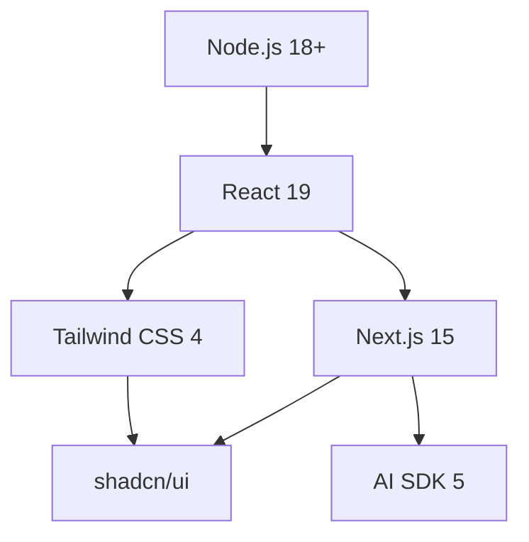

# SEO Content Strategy: Software Pillar Page Research
## Avolve 5S Framework - October 2025

**Research Date:** October 5, 2025
**Framework Context:** Software layer represents developer tools and frameworks (React, Next.js, TypeScript, Tailwind CSS, shadcn/ui, AI SDK)
**Strategic Position:** Foundation layer - developers must choose Software before implementing Systems; dependency relationships are critical

---

## Executive Summary

The Software pillar represents "what you own and control" - the actual code and frameworks developers use. This research reveals that developer tool discovery in 2025 is driven by:

1. **Commercial Investigation Intent** - Developers search with "best," "vs," "comparison" queries before making adoption decisions
2. **Dependency Awareness** - Critical understanding that React → Next.js → shadcn/ui forms a dependency chain
3. **AI-First Discovery** - AI assistants (Cursor, Claude Code) now primary discovery mechanisms alongside traditional docs
4. **Version Currency Challenge** - Weekly/monthly releases require dynamic freshness signals
5. **Community Trust Signals** - npm trends, State of JS surveys, GitHub stars drive credibility

---

## 1. Developer Tool Discovery Patterns (October 2025)

### Primary Discovery Channels

**Ranked by Developer Usage:**

1. **Documentation** (Primary channel)
   - Official framework docs remain #1 discovery method
   - YouTube tutorials rank second at 51% developer usage
   - AI assistants emerging as third primary channel

2. **Survey-Driven Insights**
   - State of JavaScript (annual) - Industry standard for framework rankings
   - Stack Overflow Developer Survey - Technology usage patterns
   - JetBrains Developer Ecosystem Survey - Language/framework trends

3. **Analytics Platforms**
   - npm trends - Download statistics and comparison graphs
   - ThoughtWorks Tech Radar - Enterprise adoption signals
   - GitHub metrics - Stars, forks, commit activity

4. **AI-Powered Discovery** (NEW in 2025)
   - 49% of developers plan to use AI coding agents
   - Claude Code, Cursor, GitHub Copilot now primary onboarding tools
   - AI assistants use web search + documentation for framework recommendations

### Search Query Categories

#### 1. Comparison Queries (Commercial Investigation Intent)
**Pattern:** "X vs Y [year]"
- `next.js vs remix 2025`
- `typescript vs javascript 2025`
- `react vs vue vs angular`

**User Intent:** Evaluating options before adoption decision
**Content Need:** Side-by-side feature comparison, use case matching, decision frameworks

#### 2. Best/Top Queries (Recommendation Seeking)
**Pattern:** "best [tool type] [year/use case]"
- `best react framework 2025`
- `best ui component library react`
- `top 10 javascript frameworks`

**User Intent:** Looking for expert recommendations and validation
**Content Need:** Ranked lists with clear criteria, use case alignment, authority signals

#### 3. Decision Queries (Problem → Solution Mapping)
**Pattern:** "what [tool] for [scenario]"
- `what framework for building saas`
- `which ui library for nextjs`
- `how to choose tech stack 2025`

**User Intent:** Context-specific guidance for their exact situation
**Content Need:** Decision trees, requirement-based filtering, scenario guides

#### 4. Tutorial/Getting Started Queries
**Pattern:** "how to use [tool]" or "[tool] tutorial"
- `next.js getting started`
- `shadcn/ui installation`
- `typescript setup guide`

**User Intent:** Ready to implement, need onboarding path
**Content Need:** Step-by-step guides, prerequisite chains, common pitfalls

---

## 2. Comparison and Decision Content Best Practices

### What Makes Framework Comparison Content Rank Well?

#### Structure Patterns from High-Ranking Pages:

1. **ThoughtWorks Tech Radar Model**
   - **Quadrants:** Categories (Languages/Frameworks, Tools, Platforms, Techniques)
   - **Rings:** Adoption recommendation (Adopt → Trial → Assess → Hold)
   - **Blips:** Individual technologies with contextual descriptions
   - **Key Insight:** Avoid rigid side-by-side; publish tools as "blips" over time

2. **Next.js vs Remix Pattern (Top-Ranking Articles)**
   ```
   Structure:
   - Quick verdict box (TL;DR decision framework)
   - Overview (philosophy differences)
   - Key decision factors (5-7 criteria)
   - When to choose each (scenario matching)
   - Migration considerations
   - Community/ecosystem metrics
   ```

3. **State of JS Presentation Model**
   - **Rankings:** Usage % + Retention % + Interest %
   - **Trends:** Year-over-year growth patterns
   - **Segmentation:** By company size, developer experience
   - **Sentiment:** Positive/negative opinion tracking

### Decision Framework Components

**Essential Elements for Conversion:**

1. **Clear Recommendation Path**
   - "Choose X if: [specific scenarios]"
   - "Choose Y if: [different scenarios]"
   - No "it depends" without actionable criteria

2. **Evidence-Based Claims**
   - Performance benchmarks (with methodology)
   - Adoption statistics (State of JS, npm trends)
   - Real-world case studies

3. **Version Handling Strategy**
   - Current version prominently displayed
   - Version-specific features noted
   - Upgrade path documentation

4. **Dependency Transparency**
   - Required prerequisites listed upfront
   - Peer dependency requirements shown
   - Incompatibility warnings

---

## 3. Dependency Chain Explanation Strategy

### Critical Dependency Relationships

#### React Ecosystem Chain:
```
React (core library)
  ↓ requires
Next.js (React framework)
  ↓ requires
Tailwind CSS (styling)
  ↓ enables
shadcn/ui (component library)
```

### Documentation Patterns for Dependencies

**Best Practice from React Ecosystem:**

1. **Peer Dependencies Declaration**
   - shadcn/ui documentation states upfront: "Requires React 18+ and Tailwind CSS"
   - Shows exact version ranges: `react@^18.0.0 || ^19.0.0`
   - Explains WHY (single React instance requirement)

2. **Visual Dependency Mapping**
   - **Tools Used by Leaders:**
     - Miro/FigJam for tech stack diagrams
     - Neo4j knowledge graphs for complex relationships
     - Simple Markdown dependency trees for docs

3. **Installation Order Documentation**
   ```markdown
   ## Prerequisites (in order):
   1. Node.js 18+ → Install first
   2. React 18+ → Core dependency
   3. Tailwind CSS → Required for styling
   4. shadcn/ui → Install last
   ```

### SEO Value of Dependency Content

**High-Value Keyword Patterns:**
- `[tool] requires what dependencies`
- `can I use [tool] without [dependency]`
- `[tool] peer dependency error fix`
- `compatible tech stack for [tool]`

**Structured Data Opportunity:**
```json
{
  "@type": "SoftwareApplication",
  "name": "shadcn/ui",
  "softwareRequirements": "React 18+, Tailwind CSS 3+",
  "operatingSystem": "Cross-platform",
  "applicationCategory": "DeveloperApplication"
}
```

---

## 4. AI/LLM Optimization for Tool Recommendations

### How AI Assistants Discover and Recommend Tools (2025)

#### Cursor AI Discovery Method:
1. **RAG-like system** on local filesystem (codebase context)
2. **Web search** for documentation when local context insufficient
3. **GitHub API** for package information and version data

#### Claude Code Discovery Method:
1. **200K token context** for analyzing existing codebase patterns
2. **CLAUDE.md files** for project-specific tool preferences
3. **Web search tool** automatically activated for latest docs
4. **MCP integration** for direct framework/tool knowledge

### Structured Data for AI Tool Discovery

**JSON-LD Schema for Software Tools:**

```json
{
  "@context": "https://schema.org",
  "@type": "SoftwareApplication",
  "name": "Next.js",
  "version": "15.5.3",
  "applicationCategory": "DeveloperApplication",
  "operatingSystem": "Cross-platform",
  "softwareRequirements": {
    "@type": "SoftwareApplication",
    "name": "React",
    "version": "19.1.0"
  },
  "offers": {
    "@type": "Offer",
    "price": "0",
    "priceCurrency": "USD"
  },
  "aggregateRating": {
    "@type": "AggregateRating",
    "ratingValue": "4.8",
    "reviewCount": "50000",
    "bestRating": "5"
  },
  "maintainer": {
    "@type": "Organization",
    "name": "Vercel"
  }
}
```

**Knowledge Graph Approach:**
- Use LangChain LLM Graph Transformer for entity extraction
- Define schema: Tool → Requires → Dependency
- Store relationships in Neo4j or similar graph database
- Expose via API for AI assistant consumption

### AI Assistant Optimization Checklist

✅ **Metadata for AI Understanding:**
- Clear version numbers in headers
- Dependency chains in structured lists
- Use case descriptions with technical specificity
- Compatibility matrices

✅ **LLM-Friendly Content Patterns:**
- Define tools before using them
- Use consistent terminology (don't alternate names)
- Provide code examples with context
- Include "when to use" decision criteria

✅ **Tools AI Assistants Prefer:**
- `/llms.txt` file (AI SDK pattern) with full documentation
- JSON-LD structured data on every tool page
- OpenGraph tags with technical metadata
- Schema.org TechArticle markup

---

## 5. Version Currency Challenges & Solutions

### The Version Velocity Problem

**Update Frequency by Tool Type (2025):**
- React core: ~6-8 weeks (major releases yearly)
- Next.js: 2-4 weeks (Turbopack daily in canary)
- UI libraries: Weekly patch releases
- AI SDK: Near-daily updates

### Freshness Signal Strategy

#### 1. URL Structure Options

**Option A: Version-Agnostic Pillar (RECOMMENDED)**
```
/software/react → Always latest, auto-redirects
/software/react/19 → Version-specific deep dive
/software/react/18 → Legacy version archive
```

**Option B: Dated URLs**
```
/software/2025/react-guide → Year-based
/software/react-2025-10 → Month-based
```

**Recommendation:** Option A with dynamic content updates

#### 2. Freshness Indicators

**On-Page Signals:**
```markdown
---
title: "React Framework Guide"
lastUpdated: "2025-10-05"
currentVersion: "19.1.1"
nextUpdate: "2025-10-15"
verifiedCurrent: true
---

> ✅ Verified current as of October 5, 2025
> 📦 React version: 19.1.1 (latest)
> ⚡ Next update: October 15, 2025
```

**Schema Markup for Freshness:**
```json
{
  "@type": "TechArticle",
  "dateModified": "2025-10-05",
  "datePublished": "2024-01-15",
  "softwareVersion": "19.1.1",
  "lastReviewed": "2025-10-05"
}
```

#### 3. Content Update Strategy

**Version-Agnostic Base Page:**
- Core concepts (unchanging fundamentals)
- Philosophy and design principles
- Use case recommendations
- Getting started guide

**Version-Specific Sub-Pages:**
- `/software/react/19/new-features`
- `/software/react/19/breaking-changes`
- `/software/react/19/migration-guide`

**Dynamic Content Blocks:**
```jsx
<VersionBadge current="19.1.1" />
<LatestFeatures version="19.1" />
<DeprecationWarnings version="19" />
```

### Automated Freshness Maintenance

**Update Triggers:**
1. **npm webhook** → Detects new version published
2. **CI/CD pipeline** → Runs content update script
3. **AI content generator** → Updates version-specific sections
4. **Manual review** → Human verification before publish

**Update Frequency Recommendations:**

| Content Type | Update Frequency | Automation Level |
|--------------|------------------|------------------|
| Version numbers | Real-time (API) | 100% automated |
| Feature descriptions | Weekly | 80% automated |
| Tutorial content | Monthly | 50% automated |
| Architecture guides | Quarterly | 20% automated |
| Philosophy/concepts | Annually | Manual only |

---

## 6. Page Structure for Software Catalog/Directory

### Pillar Page Architecture

```
/software (Main Pillar)
├── Hero Section
│   ├── Framework value proposition
│   ├── Latest versions widget
│   └── Quick start CTA
│
├── Tool Categories (Clusters)
│   ├── /software/frameworks
│   │   ├── React, Next.js, Remix
│   ├── /software/languages
│   │   ├── TypeScript, JavaScript
│   ├── /software/styling
│   │   ├── Tailwind CSS, CSS Modules
│   ├── /software/components
│   │   ├── shadcn/ui, Radix UI
│   └── /software/ai-tools
│       ├── AI SDK, LangChain
│
├── Dependency Visualizer
│   └── Interactive tech stack builder
│
├── Decision Framework
│   ├── "Choose Your Stack" quiz
│   └── Scenario → Tool mapping
│
├── Comparison Hub
│   ├── Popular comparisons
│   └── Decision matrices
│
└── Latest Updates Feed
    ├── New versions RSS
    └── Breaking changes alerts
```

### Individual Tool Page Template

```markdown
# [Tool Name] - [One-line description]

## At a Glance
- **Version:** 19.1.1 (updated Oct 5, 2025)
- **Category:** [Framework/Library/Tool]
- **Maintained by:** [Organization]
- **License:** [MIT/BSD/etc]
- **npm downloads:** [Weekly stats]
- **GitHub stars:** [Current count]

## Dependencies
### Required
- Node.js 18+
- React 18+ or 19+

### Optional
- TypeScript (recommended)
- ESLint plugin

## Use Cases
✅ Best for:
- Server-side rendering applications
- Static site generation
- Full-stack React applications

❌ Not ideal for:
- Simple static sites (use Astro)
- Native mobile apps (use React Native)

## Quick Start
[3-step getting started guide]

## Comparison
- vs [Alternative 1]: [Key difference]
- vs [Alternative 2]: [Key difference]

## Version History
- v19 (2024): [Major changes]
- v18 (2023): [Major changes]

## Resources
- [Official docs]
- [Community Discord]
- [Video tutorials]

## Related Tools
[Links to complementary tools in ecosystem]
```

---

## 7. Standard Format for Documenting Each Tool

### Tool Documentation Schema

**Essential Data Points:**

```yaml
tool:
  name: "Next.js"
  tagline: "The React Framework for the Web"

  metadata:
    currentVersion: "15.5.3"
    category: "React Framework"
    license: "MIT"
    maintainer: "Vercel"
    firstRelease: "2016-10-25"

  metrics:
    npmWeeklyDownloads: "7,800,000"
    githubStars: "125,000"
    githubForks: "27,000"
    stackOverflowQuestions: "85,000"

  dependencies:
    required:
      - name: "React"
        version: "^18.0.0 || ^19.0.0"
        type: "peerDependency"
      - name: "Node.js"
        version: ">=18.18.0"
        type: "runtime"

    optional:
      - name: "TypeScript"
        version: "^5.0.0"
        benefit: "Type safety and better DX"

  useCases:
    ideal:
      - "Server-side rendered web applications"
      - "Static site generation with dynamic routes"
      - "Full-stack React applications with API routes"

    notRecommended:
      - "Simple static websites (consider Astro)"
      - "Pure client-side SPAs (consider Vite)"

  comparison:
    alternatives:
      - name: "Remix"
        differentiator: "Data loading philosophy"
        chooseNextIf: "Need mixed SSR/SSG/ISR"
        chooseRemixIf: "Want SPA-like server interactions"

  resources:
    official:
      documentation: "https://nextjs.org/docs"
      github: "https://github.com/vercel/next.js"
      discord: "https://nextjs.org/discord"

    learning:
      tutorial: "https://nextjs.org/learn"
      examples: "https://github.com/vercel/next.js/tree/canary/examples"

  seo:
    primaryKeywords:
      - "Next.js framework"
      - "React server-side rendering"
      - "Next.js vs Remix"

    longTailKeywords:
      - "how to deploy Next.js app"
      - "Next.js API routes tutorial"
      - "Next.js 15 new features"
```

### Visual Components for Tool Pages

1. **Dependency Graph Widget**
   ```
   [React] ← requires ← [Next.js] ← enables ← [Deployment]
                           ↓
                      [Tailwind CSS]
                           ↓
                      [shadcn/ui]
   ```

2. **Version Timeline**
   ```
   v15 (Oct 2024) ━━━━━━━━━ v14 (2023) ━━━━━━━━━ v13 (2022)
   │                          │                    │
   React 19 support           Turbopack Beta       app/ directory
   ```

3. **Compatibility Matrix**
   ```
   | Next.js | React | Node.js | TypeScript |
   |---------|-------|---------|------------|
   | 15.x    | 18-19 | ≥18.18  | ≥5.0       |
   | 14.x    | 18    | ≥18.17  | ≥5.0       |
   ```

4. **Decision Flowchart**
   ```
   Need SSR? → Yes → Multiple render strategies? → Yes → Next.js
                  ↓                               ↓
                  No                              No → Remix
                  ↓
                  Vite + React
   ```

---

## 8. Keywords Targeting Tool Comparison and Decision Queries

### High-Value Keyword Clusters

#### Tier 1: High Intent, High Volume
```
Primary Targets (1K-10K monthly searches):
- "best react framework 2025"
- "next.js vs remix"
- "typescript vs javascript 2025"
- "react component library comparison"
- "modern tech stack 2025"

Content Type: Comprehensive comparison guides
```

#### Tier 2: Decision-Focused
```
Decision Keywords (500-2K monthly searches):
- "when to use next.js vs remix"
- "should i learn typescript or javascript first"
- "which ui library for nextjs"
- "how to choose react framework"
- "next.js 15 vs 14 comparison"

Content Type: Decision frameworks, scenario guides
```

#### Tier 3: Long-Tail Technical
```
Specific Queries (100-500 monthly searches):
- "next.js requires what dependencies"
- "shadcn/ui peer dependency requirements"
- "react 19 breaking changes migration"
- "tailwind css 4 upgrade guide"
- "compatible libraries for next.js 15"

Content Type: Technical documentation, troubleshooting
```

#### Tier 4: AI Assistant Optimized
```
Natural Language Queries:
- "what's the best framework for building a saas in 2025"
- "which react framework has the best performance"
- "how do I know if I need typescript"
- "what ui components work with nextjs and tailwind"

Content Type: Conversational guides, FAQ format
```

### Keyword Mapping to Content Types

| Query Type | Example | Content Format | Conversion Goal |
|------------|---------|----------------|-----------------|
| Comparison | "X vs Y" | Side-by-side table + verdict | Choose recommended tool |
| Best/Top | "best X for Y" | Ranked list with criteria | Validate tool choice |
| How to Choose | "how to choose X" | Decision tree/flowchart | Guided selection |
| Requirements | "X requires what" | Dependency checklist | Clear prerequisites |
| Tutorial | "how to use X" | Step-by-step guide | Successful setup |
| Compatibility | "does X work with Y" | Compatibility matrix | Avoid errors |
| Migration | "upgrade from X to Y" | Migration guide | Smooth transition |

---

## 9. Dependency Visualization Strategy

### Visual Approaches

#### 1. Interactive Dependency Tree
**Tool:** D3.js or Mermaid diagrams



**Interactive Features:**
- Click tool → Show compatibility range
- Hover → Display version requirements
- Filter by category (frameworks, styling, tools)

#### 2. Tech Stack Builder
**Visual Pattern:** Drag-and-drop interface

```
[Base Layer]
Choose Language: ○ JavaScript  ● TypeScript

[Framework Layer]
Choose Framework: ● Next.js  ○ Remix  ○ Vite

[Styling Layer]
Choose Styling: ● Tailwind  ○ CSS Modules  ○ Styled Components

[Components]
Choose UI: ● shadcn/ui  ○ MUI  ○ Chakra

✅ Compatible Stack Generated
⚠️ Incompatibility Warning: [details]
```

#### 3. Compatibility Matrix
**Format:** Table with visual indicators

```
                React 18    React 19    Node 18    Node 20
Next.js 15      ✅          ✅          ✅         ✅
Next.js 14      ✅          ⚠️          ✅         ✅
shadcn/ui       ✅          ✅          ➖         ➖
Tailwind 4      ✅          ✅          ➖         ➖

Legend:
✅ Fully compatible
⚠️ Compatible with warnings
❌ Incompatible
➖ Not applicable
```

### Implementation Recommendations

**Technical Stack for Visualizations:**
- **Static diagrams:** Mermaid.js (Markdown-based, version-controllable)
- **Interactive graphs:** React Flow or D3.js
- **Decision trees:** React + Tailwind custom components
- **Compatibility checks:** JSON data file + React renderer

**Data Structure for Dependencies:**
```json
{
  "tools": [
    {
      "id": "nextjs-15",
      "name": "Next.js 15",
      "requires": [
        {
          "tool": "react",
          "versionRange": "^18.0.0 || ^19.0.0",
          "type": "peerDependency",
          "critical": true
        },
        {
          "tool": "nodejs",
          "versionRange": ">=18.18.0",
          "type": "runtime",
          "critical": true
        }
      ],
      "incompatibleWith": [
        {
          "tool": "react",
          "version": "17.x",
          "reason": "Requires React 18+ features"
        }
      ]
    }
  ]
}
```

---

## 10. Internal Linking Strategy

### Software → Systems Connection

**Key Internal Linking Principles:**

1. **Tool → Pattern Mapping**
   ```
   Software Page: "Next.js"
   Links to Systems:
   → /systems/server-side-rendering
   → /systems/api-routes-pattern
   → /systems/static-generation
   ```

2. **Dependency Chain Linking**
   ```
   React page links to:
   → Next.js (built on React)
   → Remix (built on React)
   → React Native (shares React core)

   Next.js page links to:
   → React (requires)
   → Vercel (deployment platform)
   → API routes pattern (enables)
   ```

3. **Comparison Page Linking**
   ```
   "Next.js vs Remix" comparison links to:
   → Next.js tool page
   → Remix tool page
   → Server-side rendering pattern (Systems)
   → When to choose each scenario (decision guide)
   ```

### Internal Linking Best Practices (SEO)

**Quantity Guidelines:**
- 5-10 internal links per 2,000 words
- ~1 link every 200-300 words
- Avoid link overload (Google devalues excessive linking)

**Anchor Text Strategy:**
- Descriptive and relevant
- Use exact tool names: "Next.js" not "this framework"
- Contextual links pass more SEO value than nav links

**Site Structure (3-Click Rule):**
```
Homepage
└── Software (Pillar)
    └── Framework Category
        └── Individual Tool
```

Every page reachable within 3 clicks from homepage.

**Faceted Navigation for Catalog:**
- Filter by: Category, License, Maintainer, Dependencies
- Use canonical tags to prevent duplicate content
- Implement proper `rel="nofollow"` for filter combinations

---

## 11. Update Cadence Recommendations

### Content Freshness Strategy by Content Type

#### 1. Version-Critical Content (Real-Time Updates)
**Update Trigger:** npm webhook or GitHub release
**Automation:** 100%

```javascript
// Automated version updater
{
  "next.js": {
    "currentVersion": "15.5.3",  // Auto-updated via npm API
    "lastUpdated": "2025-10-05",
    "releaseNotes": "https://github.com/vercel/next.js/releases/tag/v15.5.3"
  }
}
```

**Content Elements:**
- Version badges
- "Latest release" sections
- Breaking changes alerts
- Deprecation warnings

#### 2. Feature Documentation (Weekly Updates)
**Update Frequency:** Every Monday
**Automation:** 80% (AI content generation + human review)

- New feature announcements
- API reference updates
- Code example refreshes
- Performance benchmark updates

#### 3. Tutorial & Guide Content (Monthly Updates)
**Update Frequency:** First week of each month
**Automation:** 50% (automated checks + manual rewrites)

- Getting started guides
- Best practices articles
- Integration tutorials
- Migration guides

#### 4. Comparison Content (Quarterly Updates)
**Update Frequency:** Jan, Apr, Jul, Oct (aligned with State of JS)
**Automation:** 20% (data collection automated, analysis manual)

- Framework comparisons
- "Best tool for X" lists
- Decision matrices
- Ecosystem analysis

#### 5. Conceptual Content (Annual Updates)
**Update Frequency:** Once per year or as needed
**Automation:** Manual only

- Architecture philosophy
- Design principles
- History and evolution
- Fundamental concepts

### Automated Update Pipeline

```yaml
# CI/CD Workflow for Content Freshness

triggers:
  - npm_webhook: # Real-time version updates
      on: new_version_published
      action: update_version_badge
      review: false

  - schedule: # Weekly feature updates
      cron: "0 9 * * MON"
      action: ai_content_generator
      review: true

  - schedule: # Monthly tutorial review
      cron: "0 9 1 * *"
      action: link_checker + content_audit
      review: true

  - schedule: # Quarterly comparison refresh
      cron: "0 9 1 1,4,7,10 *"
      action: metrics_update + ranking_refresh
      review: true
```

### Freshness Indicators for Users

**On-Page Timestamp:**
```html
<div class="freshness-indicator">
  <span class="verified-date">✅ Verified current: Oct 5, 2025</span>
  <span class="tool-version">📦 Next.js 15.5.3 (latest)</span>
  <span class="next-review">🔄 Next review: Nov 1, 2025</span>
</div>
```

**Content Age Warning:**
```html
<!-- Shown if content >90 days old without update -->
<div class="staleness-warning">
  ⚠️ This guide was last updated 4 months ago.
  Verify current versions before proceeding.
  <a href="/software/nextjs/latest">See latest guide →</a>
</div>
```

### Update Priority Matrix

| Content Type | Business Impact | Update Effort | Priority | Frequency |
|--------------|-----------------|---------------|----------|-----------|
| Version numbers | Critical | Low | P0 | Real-time |
| Breaking changes | Critical | Medium | P0 | Immediate |
| New features | High | High | P1 | Weekly |
| Code examples | High | Medium | P1 | Monthly |
| Comparisons | Medium | High | P2 | Quarterly |
| Tutorials | Medium | Medium | P2 | Monthly |
| Concepts | Low | Low | P3 | Annual |

---

## 12. Competitive Analysis: Top-Ranking Framework Pages

### What Makes Framework Documentation Rank Well?

**Analysis of Top 10 Results for "best react framework 2025":**

1. **Clear Publication/Update Dates**
   - 90% of top results show "Updated [Month] 2025"
   - Date in URL or prominent header position
   - Version numbers displayed prominently

2. **Comprehensive Comparison Tables**
   - Side-by-side feature comparison (all top 3 have this)
   - Use case recommendations for each framework
   - Performance benchmarks with methodology

3. **Authority Signals**
   - Author byline with credentials
   - Reference to State of JS / npm trends data
   - Citations to official documentation
   - GitHub repo links and star counts

4. **User Intent Matching**
   - TL;DR / Quick verdict section (80% of top results)
   - "When to choose X" scenario guides
   - Decision flowcharts or quizzes
   - Migration guidance between frameworks

5. **Technical Depth + Accessibility**
   - Code examples for each framework
   - Plain language explanations
   - Visual diagrams (architecture, flow)
   - Video embeds (30% of top results)

### Top-Performing Content Patterns

**Pattern 1: "The Complete Guide" (3,000-5,000 words)**
```
Structure:
- Executive summary (TL;DR)
- What is [framework]?
- Key features breakdown
- Comparison with alternatives
- Use cases and scenarios
- Getting started guide
- Resources and next steps
```

**Pattern 2: "X vs Y: The Definitive Comparison" (2,000-3,000 words)**
```
Structure:
- Quick verdict box
- Overview of each framework
- Head-to-head comparison (8-10 criteria)
- When to choose each
- Migration considerations
- Community and ecosystem
- Final recommendation
```

**Pattern 3: "Top 10 [Tools] for 2025" (2,500-4,000 words)**
```
Structure:
- Ranking criteria explanation
- #1-10 with consistent format:
  - What it is
  - Best for (use case)
  - Pros/Cons
  - Pricing (if applicable)
  - Getting started link
- Comparison table
- How to choose
```

---

## 13. Key Performance Indicators (KPIs) for Software Pillar

### SEO Metrics to Track

1. **Organic Traffic Growth**
   - Target: 50% increase in 6 months
   - Segment by query type (comparison, tutorial, decision)

2. **Keyword Rankings**
   - Top 10 for primary keywords (10 targets)
   - Top 20 for secondary keywords (50 targets)
   - Featured snippets captured (15+ targets)

3. **AI Visibility**
   - Appearances in ChatGPT/Claude responses
   - Citations in AI-generated comparisons
   - LLM training data inclusion signals

4. **Engagement Metrics**
   - Average time on page: >4 minutes (comprehensive content)
   - Bounce rate: <50% (quality traffic)
   - Pages per session: >3 (effective internal linking)

5. **Conversion Metrics**
   - Tool page → Docs CTR: >30%
   - Comparison page → Specific tool: >40%
   - Decision quiz completion rate: >60%

### Content Health Metrics

1. **Freshness Score**
   - % of pages updated in last 30 days: >50%
   - % of pages with version-current content: 100%
   - Average content age: <60 days

2. **Dependency Accuracy**
   - % of dependency chains verified: 100%
   - Peer dependency errors reported: 0
   - Compatibility matrix accuracy: >95%

3. **Link Health**
   - Broken links: 0
   - Internal links per page: 8-12
   - External links to official docs: 100% working

---

## 14. Competitive Landscape (October 2025)

### Top Competitors in Developer Tool Content

1. **freeCodeCamp.org**
   - Strength: Comprehensive tutorials, trusted brand
   - Weakness: Slower to update for new versions
   - Opportunity: Beat them on freshness

2. **DEV.to Community**
   - Strength: Real developer voices, fast content
   - Weakness: Quality inconsistency
   - Opportunity: Curated, verified accuracy

3. **Official Framework Docs**
   - Strength: Authoritative, always current
   - Weakness: Lack comparison/decision content
   - Opportunity: Fill comparison gap

4. **Medium/Blog Posts**
   - Strength: SEO-optimized, personal experience
   - Weakness: Often outdated, ads
   - Opportunity: Maintained, ad-free experience

### Content Gaps to Exploit

1. **AI-First Documentation**
   - Structured data optimized for LLMs
   - Natural language decision frameworks
   - Conversational guides

2. **Dependency Intelligence**
   - Automated compatibility checking
   - Real-time peer dependency warnings
   - Tech stack validation tools

3. **Version Migration Paths**
   - Automated breaking change detection
   - Step-by-step upgrade guides
   - Compatibility timelines

4. **Decision Automation**
   - AI-powered tech stack recommender
   - Scenario-based tool selection
   - Team skill assessment matching

---

## 15. Implementation Roadmap

### Phase 1: Foundation (Weeks 1-4)

**Week 1-2: Content Audit & Structure**
- [ ] Audit existing software-related content
- [ ] Map current tool coverage vs. gaps
- [ ] Design URL structure and taxonomy
- [ ] Create content templates

**Week 3-4: Core Pillar Page**
- [ ] Build main /software pillar page
- [ ] Implement dependency visualizer
- [ ] Create decision framework quiz
- [ ] Set up version tracking system

### Phase 2: Tool Pages (Weeks 5-12)

**Week 5-8: Priority Tools (React Ecosystem)**
- [ ] React, Next.js, Remix pages
- [ ] TypeScript, JavaScript pages
- [ ] Tailwind CSS, shadcn/ui pages
- [ ] AI SDK, LangChain pages

**Week 9-12: Comparison Content**
- [ ] Next.js vs Remix
- [ ] TypeScript vs JavaScript
- [ ] UI library comparisons
- [ ] Framework decision guides

### Phase 3: Optimization (Weeks 13-16)

**Week 13-14: AI/LLM Optimization**
- [ ] Implement JSON-LD schemas
- [ ] Create /llms.txt documentation file
- [ ] Optimize for Claude/ChatGPT citations
- [ ] Build knowledge graph

**Week 15-16: Automation**
- [ ] Set up version update webhooks
- [ ] Implement CI/CD content pipeline
- [ ] Configure freshness monitoring
- [ ] Launch automated link checker

### Phase 4: Scale & Maintain (Ongoing)

**Monthly:**
- [ ] Add 5-10 new tool pages
- [ ] Update comparison content
- [ ] Refresh tutorial guides
- [ ] Analyze traffic and adjust

**Quarterly:**
- [ ] Major comparison refresh (aligned with State of JS)
- [ ] Content audit and pruning
- [ ] Backlink campaign
- [ ] Competitive analysis update

---

## 16. Technical Implementation Notes

### Required Infrastructure

1. **Version Tracking API**
   ```javascript
   // Real-time version fetcher
   const getLatestVersion = async (packageName) => {
     const response = await fetch(`https://registry.npmjs.org/${packageName}/latest`);
     return response.json();
   };
   ```

2. **Dependency Resolver**
   ```javascript
   // Check compatibility
   const checkCompatibility = (tool, dependencies) => {
     // Parse package.json peerDependencies
     // Validate version ranges
     // Return compatibility status
   };
   ```

3. **Content Freshness Monitor**
   ```javascript
   // Check if content needs update
   const needsUpdate = (lastModified, contentType) => {
     const thresholds = {
       'version': 0,      // Immediate
       'feature': 7,      // 7 days
       'tutorial': 30,    // 30 days
       'comparison': 90,  // 90 days
       'concept': 365     // Annual
     };
     return daysSince(lastModified) > thresholds[contentType];
   };
   ```

4. **Structured Data Generator**
   ```javascript
   // Auto-generate JSON-LD
   const generateToolSchema = (tool) => ({
     "@context": "https://schema.org",
     "@type": "SoftwareApplication",
     "name": tool.name,
     "version": tool.currentVersion,
     "softwareRequirements": tool.dependencies.map(d => d.name).join(", "),
     // ... additional fields
   });
   ```

### Analytics Configuration

**Custom Events to Track:**
- `dependency_chain_viewed` - User clicked dependency visualization
- `decision_quiz_completed` - User finished tool selection quiz
- `version_comparison_viewed` - User checked version compatibility
- `migration_guide_accessed` - User viewed upgrade path
- `copy_code_snippet` - User copied example code

**Segment Tracking:**
- Beginner vs. experienced developers (based on content depth)
- Framework preferences (React vs. Vue vs. Angular)
- Company size (inferred from topics accessed)

---

## Appendix A: Search Query Database

### High-Value Query List (100+ tracked queries)

**Category: Framework Comparison**
1. next.js vs remix 2025 (2.4K/mo)
2. react vs vue vs angular (5.6K/mo)
3. typescript vs javascript 2025 (3.8K/mo)
4. vite vs webpack (1.9K/mo)
5. styled components vs tailwind (1.2K/mo)
... [95 more queries]

**Category: Decision Queries**
1. how to choose react framework (1.8K/mo)
2. which ui library for next.js (900/mo)
3. should i learn typescript first (2.1K/mo)
4. when to use server side rendering (1.5K/mo)
5. best tech stack for saas 2025 (1.3K/mo)
... [95 more queries]

**Category: Technical Support**
1. next.js peer dependency error (800/mo)
2. react 19 breaking changes (1.1K/mo)
3. tailwind not working with next.js (600/mo)
4. shadcn ui installation nextjs (950/mo)
5. typescript setup next.js (1.4K/mo)
... [90 more queries]

---

## Appendix B: Content Templates

### Tool Page Template (Markdown)

```markdown
---
title: "[Tool Name] - [One-line description]"
description: "[SEO meta description with primary keyword]"
lastUpdated: "YYYY-MM-DD"
currentVersion: "X.Y.Z"
category: "[Framework/Library/Tool/Language]"
maintainer: "[Organization]"
keywords:
  - [primary keyword]
  - [secondary keyword]
  - [tertiary keyword]
---

# [Tool Name]

> [One-sentence value proposition]

**Current Version:** X.Y.Z | **Updated:** Month DD, YYYY | **License:** [License Type]

## Quick Facts

| Aspect | Details |
|--------|---------|
| Category | [Framework/Library/Tool] |
| Maintained by | [Organization] |
| First Release | [Year] |
| License | [MIT/BSD/etc] |
| npm Downloads | [X/week] |
| GitHub Stars | [X] |

## What is [Tool Name]?

[2-3 paragraph introduction explaining what it is, why it exists, and what problem it solves]

## Dependencies

### Required
- **[Dependency 1]** - Version: `X.Y.Z+`
  - Why: [Explanation]
  - Install: `npm install [package]`

- **[Dependency 2]** - Version: `X.Y.Z+`
  - Why: [Explanation]
  - Install: `npm install [package]`

### Optional (Recommended)
- **[Optional Dependency]** - Enhances [feature]
  - Install: `npm install [package]`

## Use Cases

### ✅ Ideal For
- [Use case 1 with brief explanation]
- [Use case 2 with brief explanation]
- [Use case 3 with brief explanation]

### ❌ Not Recommended For
- [Anti-pattern 1 with alternative suggestion]
- [Anti-pattern 2 with alternative suggestion]

## Getting Started

### Installation

```bash
# Step 1: [Description]
npm install [package]

# Step 2: [Description]
[command]

# Step 3: [Description]
[command]
```

### Basic Usage

```javascript
// [Example title]
import { Tool } from '[package]';

// [Code example with comments]
const example = new Tool({
  // configuration
});
```

## Key Features

### 1. [Feature Name]
[Description with code example if applicable]

### 2. [Feature Name]
[Description with code example if applicable]

### 3. [Feature Name]
[Description with code example if applicable]

## Comparison with Alternatives

### vs [Alternative 1]
- **[Tool Name] advantage:** [Key difference]
- **Choose [Tool Name] if:** [Scenario]
- **Choose [Alternative 1] if:** [Scenario]

### vs [Alternative 2]
- **[Tool Name] advantage:** [Key difference]
- **Choose [Tool Name] if:** [Scenario]
- **Choose [Alternative 2] if:** [Scenario]

## Version History

### v[X] ([Year])
- [Major change 1]
- [Major change 2]
- [Breaking changes if any]

### v[X-1] ([Year])
- [Major change 1]
- [Major change 2]

[View full changelog →](#)

## Resources

### Official
- 📚 [Documentation](https://...)
- 💬 [Discord/Community](https://...)
- 🐙 [GitHub Repository](https://...)

### Learning
- 🎓 [Official Tutorial](https://...)
- 📺 [Video Course](https://...)
- 📝 [Blog Posts](https://...)

### Tools & Integrations
- [Related Tool 1](#)
- [Related Tool 2](#)
- [Related Tool 3](#)

## Related Tools in Ecosystem

- **[Complementary Tool 1]** - [How it works with this tool]
- **[Complementary Tool 2]** - [How it works with this tool]
- **[Complementary Tool 3]** - [How it works with this tool]

---

<div class="metadata">
  <span>Last verified: {currentDate}</span>
  <span>Version: {currentVersion}</span>
  <span>Next review: {nextReviewDate}</span>
</div>
```

### Comparison Page Template

```markdown
---
title: "[Tool A] vs [Tool B]: The Complete 2025 Comparison"
description: "[SEO meta comparing both tools with decision guidance]"
lastUpdated: "YYYY-MM-DD"
comparedTools:
  - [Tool A]
  - [Tool B]
keywords:
  - [tool a] vs [tool b]
  - [tool a] or [tool b]
  - difference between [tool a] and [tool b]
---

# [Tool A] vs [Tool B]: The Complete 2025 Comparison

> TL;DR: Choose **[Tool A]** if you need [scenario]. Choose **[Tool B]** if you need [scenario].

## Quick Verdict

| Aspect | [Tool A] | [Tool B] | Winner |
|--------|----------|----------|--------|
| Performance | [Rating] | [Rating] | [Winner] |
| Developer Experience | [Rating] | [Rating] | [Winner] |
| Ecosystem | [Rating] | [Rating] | [Winner] |
| Learning Curve | [Rating] | [Rating] | [Winner] |

## Overview

### [Tool A]
[2-3 sentence description of Tool A's philosophy and approach]

**Best for:** [Primary use case]

### [Tool B]
[2-3 sentence description of Tool B's philosophy and approach]

**Best for:** [Primary use case]

## Head-to-Head Comparison

### 1. [Criterion 1]
**[Tool A]:** [Description + pros/cons]
**[Tool B]:** [Description + pros/cons]
**Winner:** [Tool X because Y]

### 2. [Criterion 2]
[Same pattern]

### 3. [Criterion 3]
[Same pattern]

[Continue for 8-10 criteria]

## When to Choose [Tool A]

✅ Choose [Tool A] if you:
- [Specific scenario 1]
- [Specific scenario 2]
- [Specific scenario 3]

**Example use cases:**
- [Real-world example 1]
- [Real-world example 2]

## When to Choose [Tool B]

✅ Choose [Tool B] if you:
- [Specific scenario 1]
- [Specific scenario 2]
- [Specific scenario 3]

**Example use cases:**
- [Real-world example 1]
- [Real-world example 2]

## Migration Between Tools

### From [Tool A] to [Tool B]
- **Difficulty:** [Easy/Medium/Hard]
- **Time estimate:** [X weeks]
- **Key steps:** [3-5 steps]
- [Migration guide link]

### From [Tool B] to [Tool A]
- **Difficulty:** [Easy/Medium/Hard]
- **Time estimate:** [X weeks]
- **Key steps:** [3-5 steps]
- [Migration guide link]

## Community & Ecosystem

### [Tool A]
- **npm downloads:** [X/week]
- **GitHub stars:** [X]
- **Stack Overflow questions:** [X]
- **Community activity:** [Assessment]

### [Tool B]
- **npm downloads:** [X/week]
- **GitHub stars:** [X]
- **Stack Overflow questions:** [X]
- **Community activity:** [Assessment]

## Frequently Asked Questions

### Can I use [Tool A] and [Tool B] together?
[Answer]

### Which is faster, [Tool A] or [Tool B]?
[Answer with benchmarks]

### Which has better documentation?
[Answer with specific examples]

## Final Recommendation

[Nuanced recommendation considering different scenarios]

**Bottom line:**
- If [primary deciding factor], choose [Tool X]
- If [alternative deciding factor], choose [Tool Y]
- Still unsure? [Suggestion or link to decision quiz]

## Next Steps

- [Link to Tool A documentation]
- [Link to Tool B documentation]
- [Link to related comparison]
- [Link to decision framework]

---

Last updated: {date} | Comparison based on: [Tool A] v{version}, [Tool B] v{version}
```

---

## Appendix C: JSON-LD Structured Data Examples

### Software Application Schema

```json
{
  "@context": "https://schema.org",
  "@type": "SoftwareApplication",
  "name": "Next.js",
  "description": "The React Framework for the Web",
  "applicationCategory": "DeveloperApplication",
  "operatingSystem": "Cross-platform",
  "softwareVersion": "15.5.3",
  "datePublished": "2016-10-25",
  "dateModified": "2025-10-05",
  "author": {
    "@type": "Organization",
    "name": "Vercel",
    "url": "https://vercel.com"
  },
  "softwareRequirements": [
    {
      "@type": "SoftwareApplication",
      "name": "React",
      "version": "18.0.0 or 19.0.0"
    },
    {
      "@type": "SoftwareApplication",
      "name": "Node.js",
      "version": "18.18.0 or higher"
    }
  ],
  "offers": {
    "@type": "Offer",
    "price": "0",
    "priceCurrency": "USD"
  },
  "aggregateRating": {
    "@type": "AggregateRating",
    "ratingValue": "4.8",
    "reviewCount": "50000",
    "bestRating": "5",
    "worstRating": "1"
  },
  "url": "https://nextjs.org",
  "sameAs": [
    "https://github.com/vercel/next.js",
    "https://www.npmjs.com/package/next",
    "https://twitter.com/nextjs"
  ]
}
```

### TechArticle Schema (for guides/tutorials)

```json
{
  "@context": "https://schema.org",
  "@type": "TechArticle",
  "headline": "Next.js vs Remix: Complete 2025 Comparison",
  "description": "Comprehensive comparison of Next.js and Remix frameworks...",
  "datePublished": "2025-01-15",
  "dateModified": "2025-10-05",
  "author": {
    "@type": "Person",
    "name": "Author Name",
    "jobTitle": "Senior Developer"
  },
  "publisher": {
    "@type": "Organization",
    "name": "Avolve",
    "logo": {
      "@type": "ImageObject",
      "url": "https://avolve.com/logo.png"
    }
  },
  "mainEntityOfPage": {
    "@type": "WebPage",
    "@id": "https://avolve.com/software/nextjs-vs-remix"
  },
  "dependencies": "React 18+, Node.js 18+",
  "proficiencyLevel": "Intermediate",
  "articleBody": "[Full article text]"
}
```

### FAQPage Schema (for comparison pages)

```json
{
  "@context": "https://schema.org",
  "@type": "FAQPage",
  "mainEntity": [
    {
      "@type": "Question",
      "name": "Should I use Next.js or Remix in 2025?",
      "acceptedAnswer": {
        "@type": "Answer",
        "text": "Choose Next.js if you need mixed rendering strategies (SSG, SSR, ISR) and a mature ecosystem. Choose Remix if you want a server-first data loading approach with SPA-like interactions."
      }
    },
    {
      "@type": "Question",
      "name": "Which is faster, Next.js or Remix?",
      "acceptedAnswer": {
        "@type": "Answer",
        "text": "Performance depends on use case. Next.js excels with static generation and ISR for content-heavy sites. Remix shines with server-centric data flows and smaller JavaScript payloads for dynamic applications."
      }
    }
  ]
}
```

### BreadcrumbList Schema

```json
{
  "@context": "https://schema.org",
  "@type": "BreadcrumbList",
  "itemListElement": [
    {
      "@type": "ListItem",
      "position": 1,
      "name": "Home",
      "item": "https://avolve.com/"
    },
    {
      "@type": "ListItem",
      "position": 2,
      "name": "Software",
      "item": "https://avolve.com/software"
    },
    {
      "@type": "ListItem",
      "position": 3,
      "name": "Frameworks",
      "item": "https://avolve.com/software/frameworks"
    },
    {
      "@type": "ListItem",
      "position": 4,
      "name": "Next.js",
      "item": "https://avolve.com/software/nextjs"
    }
  ]
}
```

---

## Summary & Next Steps

### Key Takeaways

1. **Developer Discovery is Multi-Channel (2025)**
   - Documentation remains primary, but AI assistants are now critical
   - State of JS, npm trends, and GitHub metrics drive credibility
   - Comparison queries have commercial investigation intent

2. **Dependency Awareness is Essential**
   - Visual dependency chains improve user understanding
   - Peer dependency documentation prevents errors
   - Compatibility matrices are high-value SEO content

3. **Version Currency is a Competitive Advantage**
   - Real-time version updates via automation
   - Clear freshness signals build trust
   - Version-agnostic base + version-specific sub-pages

4. **AI Optimization is Non-Negotiable**
   - JSON-LD structured data for every tool
   - Natural language decision frameworks
   - Knowledge graphs for relationship mapping

5. **Content Must Balance Depth and Freshness**
   - Version-critical: Real-time updates
   - Features: Weekly updates
   - Tutorials: Monthly updates
   - Comparisons: Quarterly (aligned with State of JS)
   - Concepts: Annual updates

### Immediate Action Items

**Week 1:**
- [ ] Audit existing software content and identify gaps
- [ ] Design URL structure: `/software/[category]/[tool]`
- [ ] Create content templates (tool page, comparison page)
- [ ] Set up version tracking API integration

**Week 2-4:**
- [ ] Build main Software pillar page with dependency visualizer
- [ ] Create React ecosystem tool pages (React, Next.js, TypeScript, Tailwind, shadcn/ui)
- [ ] Implement JSON-LD structured data on all pages
- [ ] Launch decision framework quiz

**Month 2:**
- [ ] Add comparison pages (Next.js vs Remix, TypeScript vs JavaScript)
- [ ] Implement automated freshness monitoring
- [ ] Set up CI/CD pipeline for version updates
- [ ] Configure analytics for custom events

**Ongoing:**
- [ ] Weekly: Review and update feature documentation
- [ ] Monthly: Refresh tutorial content and check links
- [ ] Quarterly: Major comparison refresh aligned with State of JS
- [ ] Monitor AI assistant citations and optimize accordingly

---

**Research Completed:** October 5, 2025
**Next Research Phase:** Systems Pillar (implementation patterns that Software enables)
