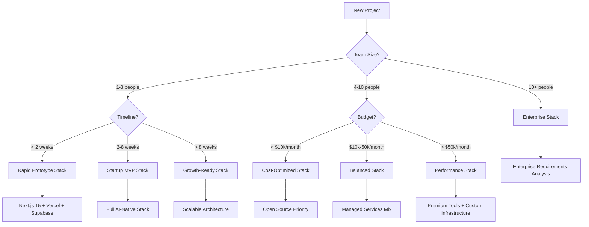

# Technology Stack Selection Decision Tree

A cognitive framework for choosing optimal technology combinations based on project constraints and team capabilities.

## Quick Decision Path



## Decision Matrix

### Primary Factors (Weight: 40%)

| Factor | Rapid Prototype | Startup MVP | Growth-Ready | Enterprise |
|--------|----------------|-------------|--------------|------------|
| **Time to Market** | < 1 week | 2-6 weeks | 2-3 months | 6+ months |
| **Team Expertise** | Any level | React experience | Full-stack team | Senior architects |
| **Scalability Needs** | Demo-ready | 1K users | 100K users | Millions |
| **Budget Constraints** | $0-500/month | $500-5K/month | $5K-50K/month | $50K+ |

### Technical Factors (Weight: 35%)

| Requirement | Technology Choice | Decision Logic |
|-------------|------------------|----------------|
| **Real-time Features** | Supabase Realtime → WebSocket fallback | Start simple, complexity on demand |
| **AI Integration** | Vercel AI SDK → Custom models | Ecosystem first, specialization later |
| **Mobile Apps** | Expo Development Builds → React Native | Cross-platform efficiency |
| **Complex State** | Zustand → Redux Toolkit → Custom | Complexity-appropriate tooling |

### Risk Factors (Weight: 25%)

| Risk Type | Mitigation Strategy | Technology Impact |
|-----------|-------------------|------------------|
| **Vendor Lock-in** | Open standards preference | Supabase (PostgreSQL) over Firebase |
| **Scaling Bottlenecks** | Horizontal-first architecture | Vercel Edge Functions + CDN |
| **Team Knowledge** | Learning curve management | TypeScript gradual adoption |
| **Technical Debt** | Future-proofing decisions | Next.js App Router early adoption |

## Recommended Stack Combinations

### 🚀 Rapid Prototype Stack (1-7 days)
**Goal**: Validate concept quickly with minimal setup

```yaml
Core:
  Framework: Next.js 15 (App Router)
  Database: Supabase (managed PostgreSQL)
  Deployment: Vercel
  Styling: Tailwind CSS + shadcn/ui

Development:
  IDE: Claude Code + Cursor
  Testing: Minimal (manual validation)
  CI/CD: Vercel auto-deploy

Trade-offs:
  ✅ Fastest time-to-demo
  ✅ Zero infrastructure management
  ❌ Limited customization
  ❌ Scaling requires architecture changes
```

### 🎯 Startup MVP Stack (2-8 weeks)
**Goal**: Production-ready application with growth potential

```yaml
Core:
  Framework: Next.js 15 (App Router + Server Actions)
  Database: Supabase (PostgreSQL + Auth + Storage)
  Deployment: Vercel (with Edge Functions)
  Styling: Tailwind CSS v4 + shadcn/ui platform

AI Integration:
  SDK: Vercel AI SDK 5.0
  Models: OpenAI GPT-4 + Anthropic Claude
  Vector Search: Supabase pgvector

Development:
  IDE: Claude Code for rapid development
  State: Zustand for client state
  Testing: Vitest + Playwright (critical paths)
  CI/CD: GitHub Actions + Vercel

Communication:
  Email: Resend + React Email
  Real-time: Supabase Realtime
  Payments: Stripe (if needed)

Trade-offs:
  ✅ Rapid development with AI assistance
  ✅ Production-ready infrastructure
  ✅ Built-in scalability patterns
  ❌ Higher complexity than prototype
  ❌ Monthly costs $100-1000
```

### 📈 Growth-Ready Stack (2-6 months)
**Goal**: Handle significant scale with team development

```yaml
Core:
  Framework: Next.js 15 (App Router + Turbopack)
  Database: Supabase + Custom PostgreSQL
  Deployment: Vercel + AWS/GCP hybrid
  Styling: Tailwind CSS v4 + Design System

Architecture:
  State: Redux Toolkit + RTK Query
  Testing: Comprehensive Vitest + Playwright + Storybook
  Monitoring: Sentry + PostHog + Custom metrics
  Cache: Upstash Redis + Vercel Edge cache

AI & Data:
  SDK: Vercel AI SDK + Custom models
  Vector DB: Pinecone or Weaviate
  Analytics: PostHog + Custom data pipeline

Team Tools:
  Development: Claude Code + Cursor + Linear
  CI/CD: GitHub Actions + Custom workflows
  Infrastructure: Terraform + Docker

Trade-offs:
  ✅ Production-grade architecture
  ✅ Team collaboration optimized
  ✅ Advanced AI capabilities
  ❌ Significant setup complexity
  ❌ Monthly costs $1K-10K
```

### 🏢 Enterprise Stack (6+ months)
**Goal**: Mission-critical applications with compliance

```yaml
Architecture:
  Microservices: Next.js + Node.js APIs
  Database: Multi-region PostgreSQL + Redis
  Deployment: Kubernetes + Multi-cloud
  Security: SOC2 + GDPR compliance

Enterprise Features:
  Auth: Custom SAML/OIDC + MFA
  Monitoring: DataDog + Custom observability
  Backup: Multi-region + Point-in-time recovery
  Compliance: Audit logging + Data governance

AI Integration:
  Custom Models: Self-hosted + API gateways
  Data Privacy: On-premise vector stores
  Governance: Model versioning + A/B testing

Trade-offs:
  ✅ Complete control and compliance
  ✅ Unlimited customization
  ✅ Enterprise security
  ❌ Massive complexity
  ❌ $50K+ monthly infrastructure
```

## Decision Process

### Step 1: Constraint Analysis (5 minutes)
1. **Timeline**: When do you need the first working version?
2. **Team**: How many developers? What's their experience level?
3. **Budget**: What's your monthly infrastructure budget?
4. **Scale**: How many users in 6 months? 2 years?

### Step 2: Requirement Mapping (10 minutes)
1. **Core Features**: List the 3-5 essential features
2. **AI Needs**: What AI capabilities are required vs nice-to-have?
3. **Integration**: What external systems need to connect?
4. **Compliance**: Any regulatory or security requirements?

### Step 3: Risk Assessment (5 minutes)
1. **Technical Risks**: What could break at scale?
2. **Business Risks**: What if requirements change dramatically?
3. **Team Risks**: What if key people leave?
4. **Market Risks**: What if timeline accelerates/decelerates?

### Step 4: Stack Selection (2 minutes)
Use the decision matrix above to map constraints → recommended stack.

### Step 5: Validation (10 minutes)
1. **Quick Win Test**: Can you implement the simplest feature in < 1 hour?
2. **Learning Curve**: Can the team be productive in < 1 week?
3. **Scaling Path**: Is there a clear upgrade path when needed?

## Common Anti-Patterns

### 🚫 Over-Engineering Early
**Problem**: Choosing enterprise stack for MVP
**Solution**: Start simple, upgrade systematically

### 🚫 Under-Engineering Late
**Problem**: Prototype patterns in production
**Solution**: Plan migration paths from day one

### 🚫 Technology Curiosity
**Problem**: Choosing new tech for learning vs delivery
**Solution**: Separate learning projects from delivery projects

### 🚫 Team Capability Mismatch
**Problem**: Stack complexity exceeds team experience
**Solution**: Match complexity to team + timeline constraints

## Next Steps

After stack selection:
1. **Learning Path**: Follow `/navigation/learning-paths/[your-stack]/`
2. **Quick Win**: Implement `/navigation/quick-wins/[first-feature]/`
3. **Mental Model**: Build understanding with `/navigation/mental-models/[architecture]/`

---

*This decision tree evolves based on technology changes and user feedback. Last updated: 2025-09-26*